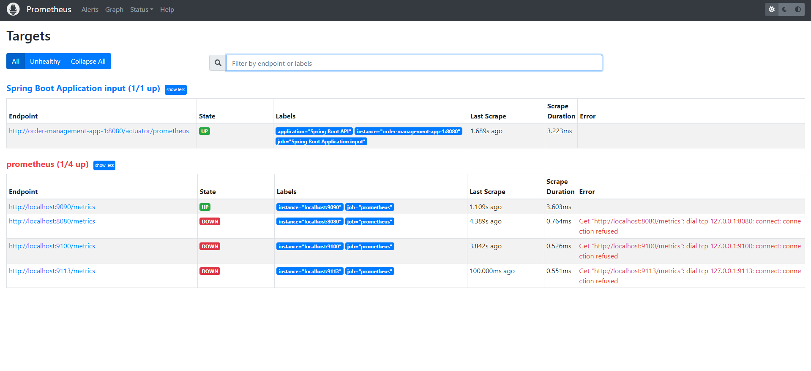
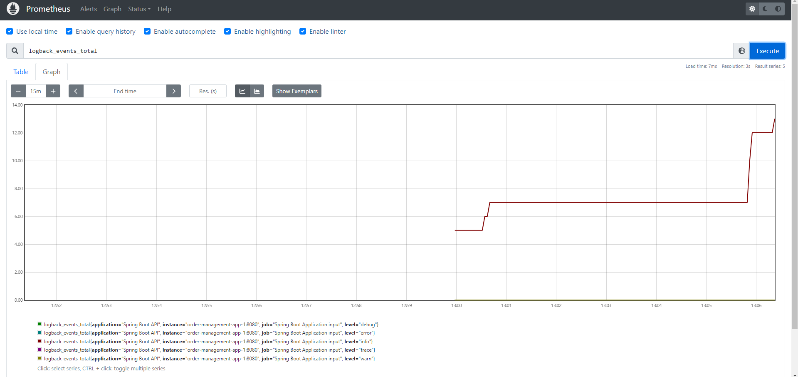
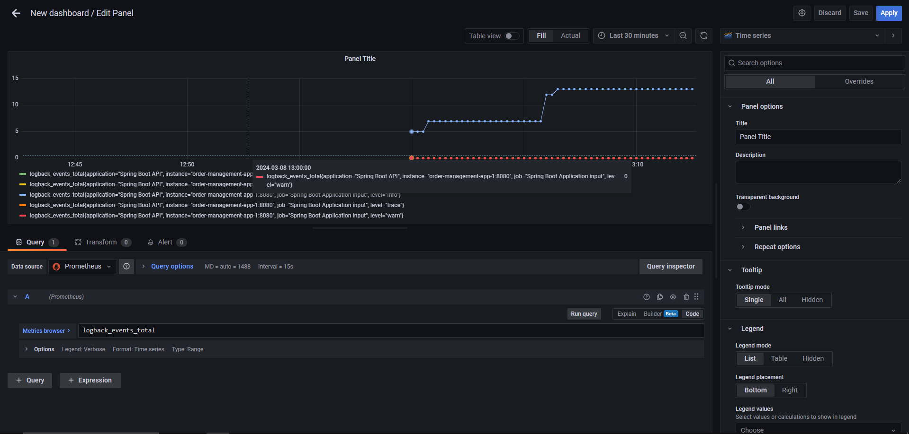

# Order Management App

latest version of the document -> https://docs.google.com/document/d/1MU2sROrm1WQASzx_I0PfWEEFq4QkEuYleCD0e_2FXnE/edit?usp=sharing
### The service provides an API
* This application comprises Order and Customer models, along with CRUD operations and includes a rate limiter (Resilience4j). 
* It includes endpoints such as `/v1/api/customer/getCustomersWithoutOrders` to fetch users without orders, `/v1/api/customer/getByNameContains/{keyword}`for filtering users by name,
  and `/v1/api/order/after/{date}` for filtering orders by a specific date. 
* The application follows a layered architecture and has unit and integration tests implemented.
* On the swagger page you can find the relevant api endpoint.
  You can reach the openapi page by `http://localhost:8080/swagger-ui/index.html` url.


---
 
## Technologies

- Java 17
- Spring Boot 3.0
- Open API Documentation
- Spring Data JPA
- Mysql
- H2 In Memory Database
- Restful API
- Resilience4j
- Maven
- Junit5
- Mockito
- Integration Tests
- Docker
- Docker Compose
- Prometheus
- Grafana
---


## Requirements
```
- Java 17 or higher
- Database (MySQL and H2 in memory DB for tests)
```
---
## Prerequisites

- Maven or Docker
---

## Docker Run
The application can be built and run by the `Docker` engine. The `Dockerfile` has multistage build, so you do not need to build and run separately.

Please follow the below directions in order to build and run the application with Docker Compose;

```sh
$ cd order-management-app
$ docker-compose up -d
```

Docker compose creates a instance of the application on port 8080

#### You can reach the open-api-ui via  `http://{HOST}:8080/swagger-ui.html`

---
### Prometheus
#### You can reach prometheus page via `http://{HOST}:9090`
 

---
### Grafana
#### You can reach grafana page via `http://{HOST}:3000` - GF_SECURITY_ADMIN_PASSWORD=admin


---
## Maven Run
To build and run the application with `Maven`, please follow the directions below;

```sh
$ cd order-management-app
$ mvn clean install
$ mvn spring-boot:run
```
You can reach the swagger-ui via  `http://{HOST}:8080/swagger-ui.html`

---
